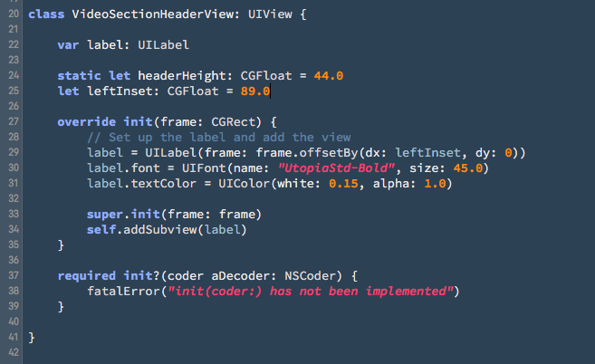

#Jory's Xcode Syntax Themes

Many color themes use wild, bright colors and too many of them. I need something more subdued, but with a congruent, color theory-based palette. 

I've been using these for a while now and I'm happy with them.

I'm currently using Adobe's wonderful open-source coding font, [Source Code Pro](https://github.com/adobe-fonts/source-c…) and highly recommend it.

## Dark

## Light

#### Installation

*Recommended:* Install Adobe's free [Source Code Pro](https://github.com/adobe-fonts/source-c…) font. 

Copy the color theme files into your `~/Library/Developer/Xcode/UserData/FontAndColorThemes/` directory.